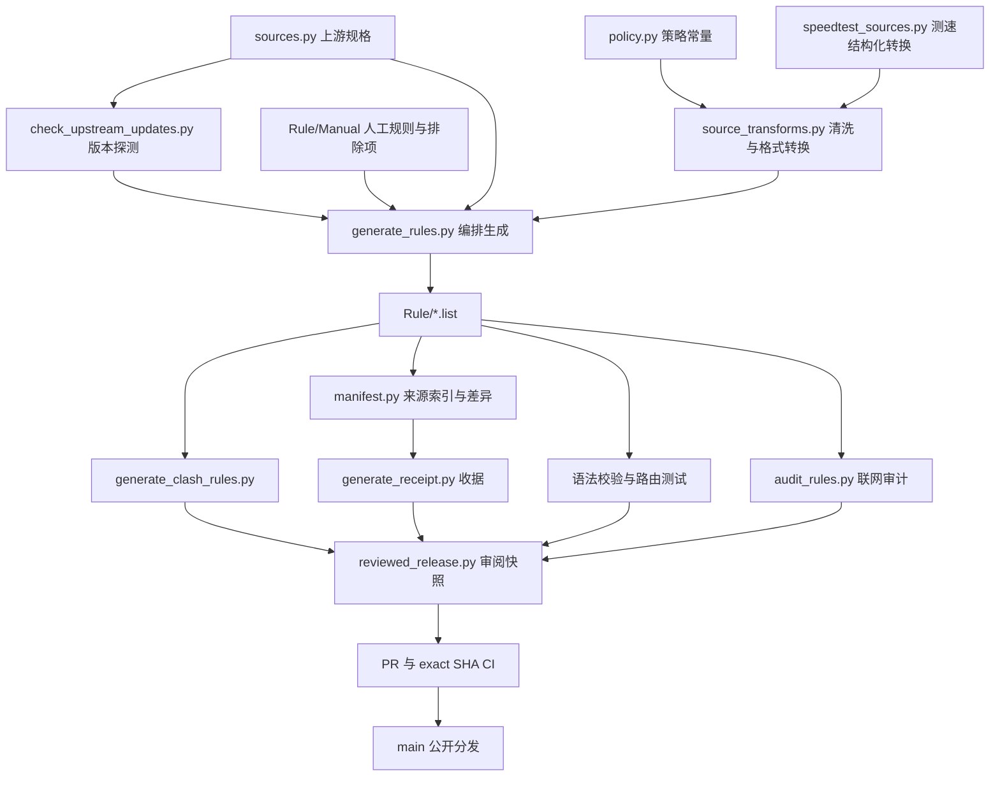

# 架构与重构记录

审查日期：2026-09-08。基线：`d84c77e`。本次覆盖核心生成、审计、校验、发布流程，辅助工具的职责边界，以及现有测试。真实设备配置与本机调度运行态不属于本次代码重构范围。

## 架构总结

这是一个以文件为接口的 Python 规则构建流水线，没有常驻服务或数据库。核心 Python 代码仅依赖标准库，网络下载另用 curl，发布依赖 Git 与 GitHub CLI。公开路径是下游契约，见 [SOURCE_OF_TRUTH.md](SOURCE_OF_TRUTH.md)。



图中的箭头表示主要依赖，完整顺序由工作流编排。DNS Mapping 模块经独立同步与 `validate_dns_module.py` 校验后也进入发布快照。日常任务在本机 Codex 中执行；仓库内 `auto-rules.yml` 提供手动全量生成和指定审阅快照发布。

| 组件 | 职责与边界 |
|---|---|
| `sources.py` | `_SOURCES` 派生规则集和 URL 映射，维护增量依赖；上游作者和公开入口策略不由转换器决定 |
| `check_upstream_updates.py` | 8 个线程探测 ETag/Last-Modified；HEAD 失败依次退到 Range GET、完整 GET；候选状态由后续成功流程晋升 |
| `source_transforms.py` | 无网络请求或输出写入；统一清洗、格式转换、排除文件读取和服务过滤。审计工具不再依赖生成器 |
| `generate_rules.py` | 人工规则优先、按上游顺序合并、过滤、去重、域名/CIDR 裁剪、验证后替换单文件，最后裁剪 Global 重叠 |
| `rule_validator.py` / `policy.py` | 语法和项目策略分离；生成器和仓库检查共用校验，在线宽泛审计保留独立告警层 |
| `manifest.py` / `generate_receipt.py` | 根据规则文本生成稳定 ID、来源归属、增删差异、内容哈希和 Clash 兼容性统计 |
| `generate_clash_rules.py` | 输出 classical provider，并拆分 China domain/extra；跳过 Surge 专属类型，明确扩展类型兼容限制 |
| `audit_upstream_sources.py` / `replay_upstream_entrypoints.py` | 哈希快照、来源贡献量化、入口离线回放；覆盖贡献不等于真实流量收益 |
| `reviewed_release.py` | 绑定仓库、基线 SHA、run ID 和内容哈希；检查路径与符号链接；发布恢复审阅字节，不重新下载上游 |
| `ios_privacy_to_surge.py` / `download_cn_candidates.py` | 用户手动运行的隐私报告转换和流量候选分析工具，不在日常规则生成主链路中 |

处理顺序也是行为契约：Manual 不经过上游排除文件；排除是精确文本匹配；服务过滤在合并后应用；去重保留最先出现的规则和来源；CIDR 裁剪保留选项差异。贡献审计将规则转为集合用于统计，不能替代生成器的顺序语义。

## 优先级问题与重构计划

优先级表示后续处理顺序；未发现需要阻止本次有限重构发布的新问题。

| 优先级 | 证据与影响 | 处理及验收条件 |
|---|---|---|
| P2，已处理 | `audit_upstream_sources.normalize` 从生成器导入转换函数，同时复制格式分支；新增格式容易只改一端 | 提取 `source_transforms.convert_source`，双方共用。保留生成器原 helper 导入名称，避免现有调用者失效；六种格式完整产物字节一致 |
| P2，已处理 | 上游探测的三条请求路径重复读取相同响应头，未显式关闭响应；并发运行时资源释放依赖对象生命周期 | 合并回退循环，用上下文管理器关闭成功响应，并关闭 HTTPError。请求顺序、头、超时、返回字段和故障判定保持一致 |
| P2，后续 | `generate_rules.main` 信任调用者传入完整 `CHANGED_RULESETS`；若直接只指定服务规则，Global 缩减后的规则恢复依赖可能遗漏 | 正常探测器已补 Global，本次修正文档示例。后续在生成器入口统一计算依赖闭包，以“服务源删除规则后 Global 恢复覆盖”的离线测试验收；这会扩大直接 CLI 调用的生成范围，应单独改动 |
| P2，后续 | `generate_rules.prune_global_first_match_overlaps` 与 `sources.OVERLAP_DEPENDENTS` 分别列举规则集；后者额外含 Apple_CN | 不应直接当成重复清单合并：触发更新和实际裁剪含义不同。后续显式声明两种关系并加配置顺序一致性检查，避免默默扩大裁剪范围 |
| P2，后续 | 单规则文件用临时文件替换，但整批规则、Global、manifest 和 Clash 输出并非一个事务 | 当前失败会阻断发布，但工作树可能含部分新产物。后续生成到独立 staging 树、全套验证后晋升，并注入中途失败验证原树完整保留 |
| P3，后续 | 生成器用相对 `Rule` 路径，其他工具多基于脚本位置定位；库函数中仍有 `sys.exit`、打印和文件 I/O | 后续引入显式工作根目录和生成结果对象；CLI 统一转换异常为退出码，保持退出码和日志契约 |
| P3，待测量 | 生成器与在线审计分别下载源；每源串行生成，CIDR 裁剪和验证重复解析网络，生成中还有临时文件读回 | 先测下载、转换、裁剪、验证阶段耗时及峰值内存，再决定是否共享运行内快照、并行预取或改内存裁剪。不宣称本次有吞吐提升 |
| P3，后续 | 多脚本各自解析规则行/注释，路由模拟器只覆盖部分 Surge 行为；普通 CI 使用 `--ci` 跳过 README/规则库存检查 | 逐步建立保留原文、顺序、选项的解析接口；新增格式先补契约测试。文档库存检查可独立加入 CI；真实 DNS/ASN/进程匹配仍需客户端验收 |

本次只实施前两项代码重构及文档纠正。后续按依赖闭包 → 批次 staging → 路径与解析接口的顺序推进，每阶段独立提交。保留上游作者、地理划分、路由策略和公开分发路径。

## 行为保持的证据

测试基线先于代码改动采集，记录在 `tests/fixtures/generation-baseline.json`，来自 `d84c77e`。不要在普通重构时用新实现自动覆盖基线；预期行为变化必须人工审阅。

- 55 项单元测试通过，重构前为 47 项。新增测试覆盖六种上游格式的完整生成文件字节、26 个目标规则集的过滤结果、Manual 排除边界、输入不被修改和空文本审计。
- HTTP 测试验证 HEAD → Range GET → full GET 的次序、UA/超时/Range 头、读取完整正文的时机、返回元数据、失败结果和资源关闭。
- 一次性离线对照将当前 26 份真实规则文件分别送入基线与新生成器，固定时间并隔离输出目录，比较转换结果与生成文件字节。它扩大了输入覆盖，但不是对未来所有上游输入的数学证明。
- 132 项路由用例、仓库完整校验、Clash 产物检查、收据一致性检查全部通过；公开 `Rule`、`clash`、`Module`、`Conf` 字节未改。联网审计为 0 ERROR、0 WARN、6 INFO。
- 原有语法、非法/空上游保护、CIDR 选项、测速地域、审阅快照和路由测试继续执行。测试不证明第三方节点永远可达，也不替代真实 Surge 的 DNS、ASN、进程和 SNI 匹配验收。

复现持久测试及产物检查：

```bash
python3 -B -m unittest discover -s tests -p 'test_*.py'
python3 -B scripts/test_routing_order.py
python3 -B scripts/validate_surge_repo.py
python3 -B scripts/generate_clash_rules.py --check --validate
python3 -B scripts/generate_receipt.py
git diff --exit-code -- Rule clash Module Conf scripts/generation_receipt.json scripts/generation_receipt.md
python3 -B scripts/audit_rules.py
git diff --check
```

本次不联网重新生成公开规则，以免把上游新变化混入行为保持重构；联网审计单独检查当前可达性。完整全量重新采样发布仍按贡献指南的审阅流程进行。
