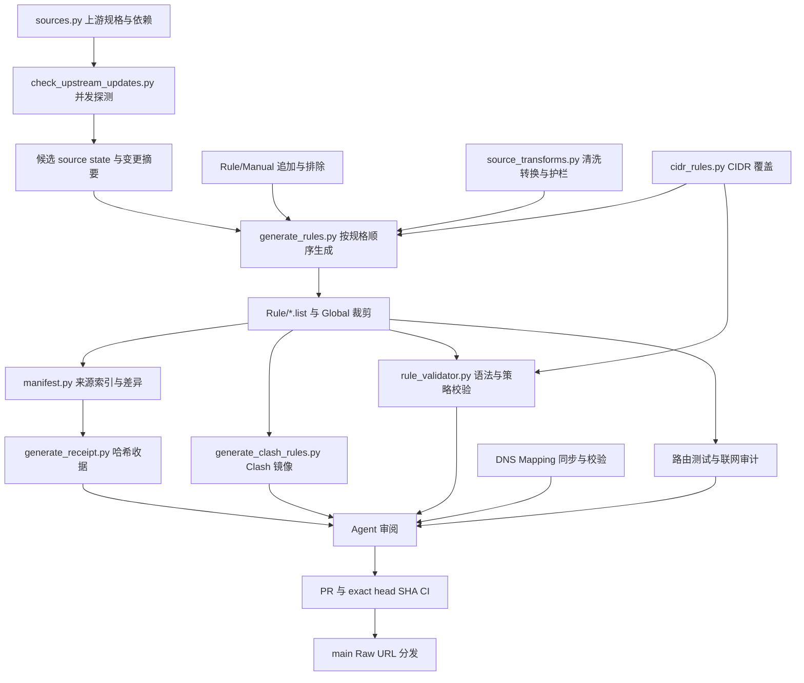

# 架构、风险与行为保持重构

审查日期：2026-09-27；修复验收：2026-09-28；基线：`716da36709816751da26abd22a400ea650956ba9`（PR #47）。
范围：规则生成、增量探测、校验、来源记录、Clash 转换、发布门禁和测试。
外部调度由 Hermes 每天北京时间 05:00 负责；运行态检查单独保存于本地，不将私有路径或设备配置写进公开仓库。

## 架构与数据流

这是一个以文件为接口的规则构建与分发流水线，没有常驻后端或数据库。
核心脚本使用 Python 3.10+ 标准库，生成器通过 curl 下载，发布依赖 Git 和 GitHub CLI。
26 个规则集共享 41 个上游 URL；`Rule/*.list`、`clash/*.yaml` 和公开配置路径是下游契约。


```mermaid
flowchart TD
    S[sources.py 上游规格与依赖] --> U[check_upstream_updates.py 并发探测]
    U --> N[候选 source state 与变更摘要]
    N --> G[generate_rules.py 按规格顺序生成]
    M[Rule/Manual 追加与排除] --> G
    T[source_transforms.py 清洗转换与护栏] --> G
    C[cidr_rules.py CIDR 覆盖] --> G
    C --> V[rule_validator.py 语法与策略校验]
    G --> R[Rule/*.list 与 Global 裁剪]
    R --> MF[manifest.py 来源索引与差异]
    R --> CL[generate_clash_rules.py Clash 镜像]
    MF --> RC[generate_receipt.py 哈希收据]
    R --> V
    R --> RT[路由测试与联网审计]
    D[DNS Mapping 同步与校验] --> REVIEW[Agent 审阅]
    V --> REVIEW
    RT --> REVIEW
    CL --> REVIEW
    RC --> REVIEW
    REVIEW --> PR[PR 与 exact head SHA CI]
    PR --> MAIN[main Raw URL 分发]
```

日常 Hermes 任务编排上述脚本，在验证与审阅成功后提升候选状态，再创建 PR。
GitHub Actions 的 `auto-rules.yml` 只有手动入口：dry-run 生成完整快照，
`reviewed_release.py` 按 repository、base SHA、run ID 和内容哈希恢复已审阅产物后发布。
CI 检查语法、策略、收据、Clash、单元测试和路由结果；生产任务健康不能由 CI 或调度启用状态代替。

| 组件 | 职责与接口 |
|---|---|
| `automation_preflight.py` | 外部调度前的工作区/状态路径检查与备用失败收据；不负责发布或断言维护成功 |
| `sources.py` | `_SOURCES` 派生 `RULE_SPECS` 与 `SOURCE_URL_MAP`；集中声明 Global 裁剪来源与仅触发重建的额外依赖 |
| `check_upstream_updates.py` | 8 线程探测，HEAD → Range GET → full GET；stdout 输出 `rulesets` 等摘要，`--state-out` 单独写 URL 索引候选状态 |
| `source_transforms.py` / `speedtest_sources.py` | 清洗、六种格式转换、精确排除和项目护栏；测速按来源国家/省份字段分类 |
| `generate_rules.py` | Manual 优先、上游顺序合并、去重、域名/CIDR 裁剪、校验与单文件替换；最后裁剪 Global |
| `cidr_rules.py` | 无 I/O 的 CIDR 覆盖检测与行裁剪，生成与校验共用；按地址族和完整选项组合分组 |
| `rule_validator.py` / `policy.py` | 共用语法校验和项目策略；保留错误顺序、行号及严格阻断语义 |
| `manifest.py` / `generate_receipt.py` | 稳定 ID、最先保留来源、增删差异、内容哈希与兼容统计 |
| `generate_clash_rules.py` | classical providers 和 China domain/extra 拆分；显式报告 Surge 专属类型与扩展兼容限制 |
| `audit_rules.py` / `audit_upstream_sources.py` | 当前可达性、共享基础设施、数量检查与来源贡献；来源覆盖不能证明实际流量收益 |
| `reviewed_release.py` | 审阅快照捕获与恢复；限定路径、拒绝符号链接、验证哈希与提交身份 |
| 辅助脚本 | `ios_privacy_to_surge.py`、`download_cn_candidates.py`、入口回放和跨文件冲突分析，不属于日常主链路 |

## 行为契约

- Manual 不受上游 exclude 文件过滤；exclude 精确匹配，去重保留最先出现的文本及来源。
- 生成顺序仍来自 `RULE_SPECS`，不依赖集合迭代顺序；空增量选择不生成规则。
- 22 个规则集参与 Global 精确文本裁剪；`Apple_CN.list` 额外触发重建，但不参与裁剪。两者不可直接合并成同一语义。
- CIDR 仅在严格父子网段且选项完全相同的情况下裁剪；等价网段、不同选项、重复选项和非法输入保持原行为。
- `no-resolve` 影响 DNS 求值，first-match 顺序影响最终策略，均不能作为格式噪声删除。依据：[官方 IP 规则](https://manual.nssurge.com/rules/ip.html)、[规则求值顺序](https://manual.nssurge.com/rules/overview.html)。
- 保留 `prune_redundant_cidr(Path)` 兼容入口、日志和返回值；生成过程改用内存行列表，仍保留临时文件验证后替换、文件权限和失败清理。

## 优先级问题与重构计划

| 优先级 / 状态 | 问题、影响与证据 | 处理 / 验收 |
|---|---|---|
| P2，已完成 | 生成器与校验器重复枚举每个 CIDR 的全部祖先前缀，语义易漂移；每条 IPv6 最多构造 128 个父网段 | 共用 `redundant_cidr_indices`，只检查该地址族和选项组合实际存在的前缀；边界基线、独立 pairwise oracle 和真实规则对照一致 |
| P2，已完成 | 生成器为 CIDR 裁剪先写临时文件，再读、可能重写、再次读 | 改为 `prune_cidr_lines`，最终文件只写一次；保留空内容及 Unicode 分行行为、权限、替换失败后原文件 |
| P2，已完成 | Global 依赖在探测器/生成器重复展开，实际裁剪另有一份名单 | 单一声明与展开函数；全部 41 个源、26 个规则集、配置先后顺序及 Apple_CN 例外均测试 |
| P2，已完成 | README、脚本说明与事实来源仍称 Codex 调度 | 改为 Hermes 所有权；频率与当前运行健康以外部调度配置及带时间的执行证据为准 |
| P2，待处理 | 单文件替换不是整批事务；中途失败可能留下部分新 Rule、Global、manifest、Clash，`restore` 也逐文件写入 | 下一阶段在独立 staging 树构建整个批次，验证后发布；注入第二个文件失败、Global 失败和磁盘写失败，验证旧批次完整保留 |
| P2，待处理 | 网络门禁和发布次序大量依赖外部 Agent 提示词；上游探测即使部分不可达也可返回 0，stdout 与候选状态是不同结构 | 本次已补前置检查、备用失败收据和 Hermes 失败标记合同；后续将业务成功判据、候选提升与锁封装成运行器；上游异常必须停在生成前，进程成功不得冒充业务成功 |
| P3，待处理 | 生成器用相对工作目录，其他脚本多根据 `__file__` 定位；库函数仍有 `sys.exit` 与日志副作用 | 引入显式根目录和结果/异常对象，CLI 保持原退出码和日志；从不同 cwd 执行做契约测试 |
| P3，待处理 | 多处各自解析注释/规则，路由模拟只覆盖部分客户端行为；语法白名单不能代表全部新版本 Surge 能力 | 按原文、顺序、选项建立共享解析接口；新增语法作为独立行为变化审阅，不能借重构放宽策略 |
| P3，待测量 | 生成与在线审计分别下载，生成按源串行；跨阶段内容可能变动 | 先记录下载与 CPU 耗时，再考虑同运行的来源快照；不能用本地 CPU 改善推断端到端耗时 |

执行顺序：本次共用纯函数与依赖声明 → 整批 staging → 确定性运行器与失败收据 → 根目录/解析接口。
各阶段独立验证，不改变上游作者、地域分类、策略归属或公开分发路径。

## 已完成的验证

- 改动前：57 项单元测试、132 项路由测试通过；改动后：69 项单元测试、132 项路由测试通过。
- `fixtures/cidr-baseline.json` 在修改前从 `716da36` 采集 12 类输入的文件字节、日志、错误文本与依赖集合，不由新实现重录。
- 新增用例覆盖 IPv4/IPv6、/0、主机路由、选项组合、错误行号、不改输入、权限和替换失败；600 个带固定种子的网段条目由独立两两 `subnet_of` 判据对照。
- `compare_pipeline_baseline.py` 从 Git 读取旧版 Python 脚本，在两个独立进程中对当前 26 份真实规则离线回放，比较完整文本、诊断、源规格及最终 Global 裁剪；另测空内容和 Unicode 分行，全部相同。
- 该次离线回放 2.374 秒 → 1.802 秒，仅为一次本机观测，包含本地生成与校验，不含网络和发布，不作为稳定性能承诺。
- 完整仓库校验及 `--ci`、Clash 镜像检查均通过；在线审计 41 个来源，0 ERROR、0 WARN、6 INFO，均为既有服务域名的共享基础设施提示。
- 自动化前置检查新增真实临时 Git、原子替换、权限失败、备用收据和旧调度器冲突测试；私有路径适配器单独部署。
- `Rule/`、`clash/`、`Module/`、`Conf/` 未改，规则没有移动或删除。收据仅更新 `sources.py` 源文件哈希，规则与来源 URL 均未变。
- 验证是本地证据。远端发布须单独核对新提交 CI，不能沿用基线提交的远端 CI 当作新代码 CI；测试也不替代真实客户端 DNS/ASN/进程/SNI 验收。

```bash
python3 -B -m unittest discover -s tests -p 'test_*.py'
python3 -B tests/compare_pipeline_baseline.py
python3 -B scripts/test_routing_order.py
python3 -B scripts/validate_surge_repo.py
python3 -B scripts/validate_surge_repo.py --ci
python3 -B scripts/generate_clash_rules.py --check --validate
python3 -B scripts/generate_receipt.py
git diff --check
python3 -B scripts/audit_rules.py
```

旧/新对照需要本地 Git 中有基线提交（浅克隆需先取得该提交），只在临时目录回放并自动清理；不会下载上游或改写公开规则。
